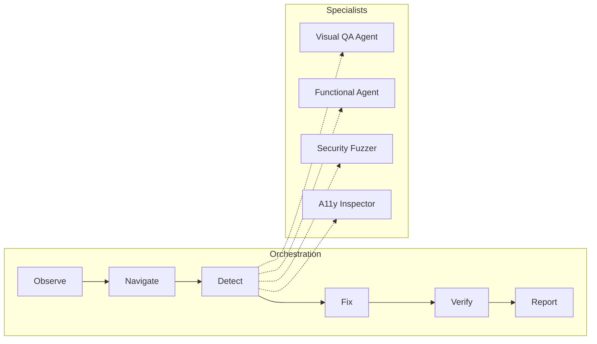

# QA Testing Agent: The Autonomous QA Engineer

> **A State-Driven, Multi-Agent Visual & Functional Testing Platform**

This is not a testing tool; it is an **Autonomous QA Engineer**. It perceives web applications with a human-like visual understanding while inspecting them with surgical technical precision. Built on a sophisticated **LangGraph** orchestration, it eliminates manual test scripts by "thinking" its way through your product to find regressions, vulnerabilities, and accessibility gaps.

---

## 🏗️ Technical Architecture: The LangGraph Brain

Unlike legacy QA automation that follows a linear path, My Agent uses a **State-Driven Orchestrator (LangGraph)**. This allows the agent to:
- **Observe**: Scan the initial environment and handle dynamic redirects.
- **Navigate**: Deep-crawl the site using a **Playwright-powered Autonomous Navigator**.
- **Detect**: Parallelize inspections across 4 specialist agents.
- **Fix**: Generate precise CSS/JS remediation code in real-time.
- **Report**: Synthesize findings into executive-grade PDF summaries.

### The Agentic Workflow


---

## 🤖 Meet the Agents

### 1. Visual QA Agent (Gemini 2.5 Vision)
The "Eyes" of the system. It uses **Gemini 2.5 Pro** to analyze screenshots for layout shifts, font inconsistencies, and color mismatches. It can even compare a live site against a **Figma Design Mockup** to identify design-to-code deviations.

### 2. Autonomous Navigator (Playwright)
The "Body" of the system. It handles the heavy lifting of:
- Deep crawling for hidden pages.
- Interacting with infinite scrolls, modals, and dynamic menus.
- Capturing network-level API failures (4xx/5xx) and console errors.

### 3. Functional QA Agent
Attempts to interact with input fields, buttons, and forms. It detects broken workflows and provides a "Success Path" audit for critical user journeys.

### 4. Accessibility & Security Shield
- **A11y**: Injects `axe-core` to find WCAG 2.1 violations with 100% accuracy.
- **Security**: Runs shallow fuzzing for common vulnerabilities like reflected XSS and SQL injection patterns in input fields.

---

## 🛠️ Tech Stack & Implementation

- **AI Core**: Google Gemini 2.5 SDK (Flash & Pro).
- **Graph Orchestration**: LangGraph / LangChain.
- **Backend Framework**: FastAPI (Python 3.12).
- **Frontend Stack**: React, Vite, Framer Motion, Tailwind CSS.
- **Persistence**: SQLite with SQLAlchemy (Persistent History & Scan Memory).
- **PDF Infrastructure**: ReportLab (Custom-engineered Light Theme Reporting).
- **Infrastructure**: Dockerized Deployment on **Google Cloud Run**.

---

## 🚀 Reproducible Setup & Testing

### 1. Environment Configuration
Create a `.env` file in the root:
```env
GEMINI_API_KEY=your_google_api_key
PORT=8080
```

### 2. Local Development (Manual)
**Backend:**
```bash
cd backend
python -m venv .venv
source .venv/bin/activate
pip install -r requirements.txt
playwright install chromium
uvicorn main:app --port 8080
```

**Frontend:**
```bash
cd frontend
pnpm install
pnpm build
```

### 3. Docker (Recommended for Judges)
The entire environment is containerized for zero-config testing:
```bash
# Build the container
docker build -t  .

# Run the container
docker run -p 8080:8080 -e GEMINI_API_KEY=your_key 
```
Access the UI at `http://localhost:8080`.

### 4. Reproducible Scan Test
1.  **Launch** the application.
2.  **Paste** `https://example.com` into the URL field.
3.  **Click "Analyze"**: Watch the "Brain" visualize its steps (Observe -> Navigate -> Detect).
4.  **Verification**: After ~60 seconds, you will see a vertical navigation bar populated with Bug Cards.
5.  **Fix Check**: Click a Bug Card to see the AI-generated **CSS Fix** and **DevTools Command**.

---

## 🏆 Accomplishments we're proud of
- **Zero-Config QA**: No test scripts. No selector hunting. Just a URL.
- **Visual Intuition**: Bridging the gap between "It works" and "It looks right" using Gemini Vision.
- **Cloud-Scale Infra**: Running full-blown Chromium instances in serverless Cloud Run for deep scanning.

---
**QA Testing Agent** — Reclaiming 30% of the dev-cycle by automating the intuition of a Senior QA Engineer. 🚀
